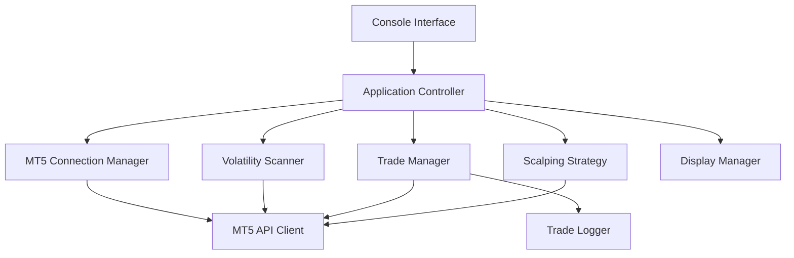

# Design Document: MT5 Auto Scalper

## Overview

The MT5 Auto Scalper is a console-based automated trading application that connects to MetaTrader 5 accounts, identifies high-volatility trading opportunities, and executes scalping trades automatically using a 5-minute timeframe strategy. The system is designed with a modular architecture separating concerns between MT5 connectivity, market analysis, trade execution, and user interface.

The application follows an event-driven architecture where market data triggers analysis, which in turn triggers trading decisions. The system maintains persistent connection monitoring and implements graceful degradation during network interruptions.

## Architecture

### High-Level Architecture



### Technology Stack

- **Language**: Python 3.10+
- **MT5 Integration**: MetaTrader5 Python package
- **Async Operations**: asyncio for concurrent market monitoring
- **Configuration**: Environment variables and runtime prompts
- **Logging**: Python logging module with file and console handlers

### Component Architecture

The system is organized into the following layers:

1. **Presentation Layer**: Console interface for user interaction
2. **Application Layer**: Core business logic and workflow orchestration
3. **Domain Layer**: Trading strategy, volatility analysis, and risk management
4. **Infrastructure Layer**: MT5 API integration and data persistence

## Components and Interfaces

### 1. MT5 Connection Manager

**Responsibility**: Manages authentication, connection lifecycle, and reconnection logic for MT5 API.

**Interface**:
```python
class MT5ConnectionManager:
    def connect(self, account: int, password: str, server: str) -> bool
    def disconnect(self) -> None
    def is_connected(self) -> bool
    def get_account_info(self) -> AccountInfo
    def reconnect(self, max_attempts: int = 5) -> bool
    def start_heartbeat_monitor(self) -> None
```

**Key Behaviors**:
- Validates credentials before attempting connection
- Implements exponential backoff for reconnection attempts
- Monitors connection health via periodic heartbeat checks
- Emits connection state change events

### 2. Volatility Scanner

**Responsibility**: Analyzes available trading instruments and ranks them by volatility metrics.

**Interface**:
```python
class VolatilityScanner:
    def scan_instruments(self, symbols: List[str], timeframe: str = "5m") -> List[InstrumentVolatility]
    def calculate_volatility(self, symbol: str, periods: int = 20) -> float
    def get_available_symbols(self) -> List[str]
    def rank_by_volatility(self, instruments: List[InstrumentVolatility]) -> List[InstrumentVolatility]
```

**Volatility Calculation**:
- Uses Average True Range (ATR) as the primary volatility metric
- Normalizes ATR by current price to enable cross-instrument comparison
- Considers recent 20 periods (100 minutes) of 5-minute candles
- Filters out instruments with insufficient liquidity or trading hours

### 3. Scalping Strategy

**Responsibility**: Implements the trading logic for entry and exit signals.

**Interface**:
```python
class ScalpingStrategy:
    def analyze_entry(self, symbol: str, candles: List[Candle]) -> Optional[Signal]
    def analyze_exit(self, position: Position, current_price: float) -> Optional[Signal]
    def calculate_position_size(self, equity: float, risk_percent: float, stop_loss_pips: float) -> float
    def set_parameters(self, params: StrategyParameters) -> None
```

**Strategy Logic**:
- **Entry Signal**: Combines momentum (RSI) and volatility breakout with directional determination
  
  **BUY Signal Conditions**:
  - RSI crosses above 30 (oversold bounce)
  - Price breaks above recent high (resistance breakout)
  - Current candle closes above previous candle high
  - ATR confirms sufficient volatility for scalping
  - Volume is above average (confirms momentum)
  
  **SELL Signal Conditions**:
  - RSI crosses below 70 (overbought reversal)
  - Price breaks below recent low (support breakdown)
  - Current candle closes below previous candle low
  - ATR confirms sufficient volatility for scalping
  - Volume is above average (confirms momentum)
  
- **Exit Signal**: Multiple exit conditions (same for both directions)
  - Take profit: 1.5x ATR from entry
  - Stop loss: 1x ATR from entry
  - Time-based: Close after 30 minutes if no profit target hit
  - Trailing stop: Activates after 1x ATR profit

### 4. Trade Manager

**Responsibility**: Executes trades, monitors open positions, and manages order lifecycle.

**Interface**:
```python
class TradeManager:
    def open_position(self, signal: Signal, size: float) -> Optional[Position]
    def close_position(self, position: Position) -> TradeResult
    def get_open_positions(self) -> List[Position]
    def get_position_count(self) -> int
    def can_open_new_position(self) -> bool
    def monitor_positions(self) -> None
    def close_all_positions(self) -> List[TradeResult]
    def set_max_positions(self, max_positions: int) -> None
```

**Key Behaviors**:
- Validates orders before submission (margin, symbol availability)
- Tracks position state (pending, open, closed)
- Implements retry logic for failed orders
- Maintains position registry for monitoring

### 5. Display Manager

**Responsibility**: Handles all console output formatting and real-time updates.

**Interface**:
```python
class DisplayManager:
    def show_welcome(self) -> None
    def prompt_credentials(self) -> Credentials
    def prompt_trading_parameters(self) -> TradingParameters
    def display_parameter_summary(self, params: TradingParameters) -> bool
    def display_account_info(self, info: AccountInfo) -> None
    def display_instruments(self, instruments: List[InstrumentVolatility]) -> None
    def display_trade_opened(self, position: Position) -> None
    def display_trade_closed(self, result: TradeResult) -> None
    def display_position_count(self, current: int, maximum: int) -> None
    def display_error(self, message: str) -> None
    def update_status_line(self, status: str) -> None
```

### 6. Application Controller

**Responsibility**: Orchestrates the application workflow and coordinates between components.

**Interface**:
```python
class ApplicationController:
    def run(self) -> None
    def startup_sequence(self) -> bool
    def main_loop(self) -> None
    def shutdown_sequence(self) -> None
    def handle_user_input(self) -> None
```

**Workflow**:
1. Startup: Prompt credentials → Connect → Display equity
2. Configuration: Prompt trading parameters → Display summary → Confirm
3. Selection: Scan instruments → Display options → User selects
4. Trading: Monitor markets → Generate signals → Execute trades (respecting max positions)
5. Shutdown: Stop new trades → Prompt position closure → Disconnect

## Data Models

### AccountInfo
```python
@dataclass
class AccountInfo:
    account_number: int
    equity: float
    balance: float
    margin: float
    free_margin: float
    currency: str
```

### InstrumentVolatility
```python
@dataclass
class InstrumentVolatility:
    symbol: str
    volatility_score: float
    current_price: float
    atr: float
    last_update: datetime
```

### Signal
```python
@dataclass
class Signal:
    symbol: str
    direction: str  # "BUY" or "SELL" - determined by strategy analysis
    entry_price: float
    stop_loss: float
    take_profit: float
    timestamp: datetime
    confidence: float  # 0.0 to 1.0, based on signal strength
    reason: str  # e.g., "RSI_OVERSOLD_BREAKOUT" or "RSI_OVERBOUGHT_BREAKDOWN"
```

### Position
```python
@dataclass
class Position:
    ticket: int
    symbol: str
    direction: str
    volume: float
    entry_price: float
    current_price: float
    stop_loss: float
    take_profit: float
    profit: float
    open_time: datetime
```

### TradeResult
```python
@dataclass
class TradeResult:
    ticket: int
    symbol: str
    direction: str
    volume: float
    entry_price: float
    exit_price: float
    profit: float
    open_time: datetime
    close_time: datetime
    exit_reason: str
```

### Credentials
```python
@dataclass
class Credentials:
    account: int
    password: str
    server: str
```

### TradingParameters
```python
@dataclass
class TradingParameters:
    max_open_positions: int
    risk_percent: float  # Percentage of equity to risk per trade
    profit_target_atr_multiplier: float = 1.5
    stop_loss_atr_multiplier: float = 1.0
    trailing_stop_enabled: bool = True
```


## Correctness Properties

*A property is a characteristic or behavior that should hold true across all valid executions of a system-essentially, a formal statement about what the system should do. Properties serve as the bridge between human-readable specifications and machine-verifiable correctness guarantees.*

Property 1: Connection attempt on credential submission
*For any* submitted credentials (valid or invalid), the application should attempt to establish an MT5 connection
**Validates: Requirements 1.2**

Property 2: Application flow progression on successful connection
*For any* successful MT5 connection, the application should transition to the main application flow (equity display phase)
**Validates: Requirements 1.5**

Property 3: Equity retrieval after connection
*For any* established MT5 connection, the application should attempt to retrieve account equity
**Validates: Requirements 2.1**

Property 4: Equity display formatting
*For any* retrieved equity value, the displayed output should include the value formatted with appropriate decimal precision and the account's base currency
**Validates: Requirements 2.2, 2.4**

Property 5: Trading parameters prompt
*For any* displayed account equity, the application should prompt the user for trading parameters including maximum open positions and risk percentage
**Validates: Requirements 3.1, 3.3**

Property 6: Trading parameters validation
*For any* user-entered maximum open positions value, the application should validate it is a positive integer before accepting
**Validates: Requirements 3.2**

Property 7: Parameter confirmation display
*For any* collected trading parameters, the application should display a summary and request user confirmation before proceeding
**Validates: Requirements 3.4, 3.5**

Property 8: Volatility analysis trigger
*For any* confirmed trading parameters, the volatility scanner should begin analyzing available instruments using 5-minute timeframe data
**Validates: Requirements 4.1**

Property 9: Volatility calculation for all instruments
*For any* instrument being analyzed, the volatility scanner should calculate volatility metrics based on recent price movements
**Validates: Requirements 4.2**

Property 10: Ranked instrument display
*For any* completed volatility analysis, the displayed instrument list should be ranked by volatility score in descending order
**Validates: Requirements 4.3**

Property 11: Complete instrument information display
*For any* instrument in the displayed list, the output should include symbol, volatility metric, and current price
**Validates: Requirements 4.4**

Property 12: Continuous monitoring of selected instruments
*For any* user-selected instruments, the trade manager should actively monitor them using 5-minute timeframe data
**Validates: Requirements 5.1**

Property 13: Trade direction determination
*For any* market analysis, the scalping strategy should determine the trade direction (BUY or SELL) based on technical indicators, and the generated signal should include this direction
**Validates: Requirements 5.1, 5.2**

Property 14: Position sizing on entry signals
*For any* entry signal identified by the scalping strategy, the trade manager should calculate position size based on current account equity and risk parameters
**Validates: Requirements 5.2**

Property 15: Order submission and verification
*For any* calculated position size, the trade manager should submit a market order and verify its execution status
**Validates: Requirements 5.3, 5.4**

Property 16: Maximum position limit enforcement
*For any* entry signal, when the number of open positions equals the configured maximum, the trade manager should not open new positions until existing positions close
**Validates: Requirements 5.6**

Property 17: Exit order submission on signals
*For any* exit signal identified by the scalping strategy, the trade manager should submit a close order to MT5
**Validates: Requirements 6.2**

Property 18: Automatic position closure at thresholds
*For any* open position, when the current price reaches either the predefined profit target or stop loss level, the trade manager should automatically close the position
**Validates: Requirements 6.3, 6.4**

Property 19: Complete trade logging on closure
*For any* closed trade, the logged result should include entry price, exit price, profit/loss, and timestamps
**Validates: Requirements 6.5**

Property 20: Complete trade event display
*For any* trade event (open or close), the console display should include all required details (instrument, direction, size, prices, profit/loss) and a timestamp
**Validates: Requirements 7.2, 7.3, 7.4**

Property 21: Position count display
*For any* active trading session, the console should display the current number of open positions versus the configured maximum
**Validates: Requirements 7.6**

Property 22: Periodic equity updates during monitoring
*For any* active market monitoring session, the console should display account equity updates at regular intervals (every 30 seconds)
**Validates: Requirements 7.5**

Property 23: Disconnection detection timing
*For any* MT5 connection loss, the application should detect the disconnection within 10 seconds
**Validates: Requirements 8.1**

Property 24: Reconnection with state preservation
*For any* detected disconnection, the application should attempt automatic reconnection while pausing new entries and continuing to monitor open positions
**Validates: Requirements 8.2, 8.3, 8.4**

Property 25: Shutdown stops new positions
*For any* user-initiated shutdown, the application should immediately stop opening new positions while maintaining existing position monitoring
**Validates: Requirements 9.2**

Property 26: Complete shutdown workflow
*For any* shutdown initiation, the application should display open positions, prompt for closure instructions, execute the user's choice, disconnect from MT5, and terminate cleanly
**Validates: Requirements 9.3, 9.4, 9.5**

## Error Handling

### Connection Errors

**Scenarios**:
- Invalid credentials
- Network timeout
- MT5 server unavailable
- API initialization failure

**Handling Strategy**:
- Display clear, actionable error messages
- Implement retry logic with exponential backoff
- Allow user to re-enter credentials without restarting
- Log all connection attempts for debugging

### Trading Errors

**Scenarios**:
- Insufficient margin
- Invalid order parameters
- Symbol not available for trading
- Market closed
- Order rejection by broker

**Handling Strategy**:
- Validate orders before submission
- Log all errors with context (symbol, parameters, timestamp)
- Continue monitoring other instruments on individual failures
- Alert user for critical errors requiring intervention
- Implement order retry for transient failures (max 3 attempts)

### Data Errors

**Scenarios**:
- Missing price data
- Incomplete candle history
- Corrupted tick data
- API data format changes

**Handling Strategy**:
- Validate data completeness before analysis
- Skip instruments with insufficient data
- Use fallback calculations when possible
- Log data quality issues for review

### System Errors

**Scenarios**:
- Memory exhaustion
- Thread/async task failures
- File I/O errors (logging)
- Unexpected exceptions

**Handling Strategy**:
- Implement global exception handler
- Gracefully degrade functionality when possible
- Ensure position data is preserved
- Provide emergency shutdown mechanism
- Log full stack traces for debugging

## Testing Strategy

### Unit Testing

The application will use **pytest** as the testing framework with the following focus areas:

**Component Tests**:
- MT5ConnectionManager: Test connection logic, reconnection, heartbeat monitoring (with mocked MT5 API)
- VolatilityScanner: Test ATR calculation, ranking logic, symbol filtering
- ScalpingStrategy: Test entry/exit signal generation with various market conditions
- TradeManager: Test order validation, position tracking, closure logic
- DisplayManager: Test output formatting, data presentation

**Integration Tests**:
- Test workflow from credential input through instrument selection
- Test complete trade lifecycle (signal → order → execution → monitoring → closure)
- Test reconnection handling with simulated disconnections
- Test shutdown sequence with various position states

**Edge Cases**:
- Empty instrument lists
- Zero equity accounts
- Simultaneous multiple signals
- Rapid connection state changes

### Property-Based Testing

The application will use **Hypothesis** for property-based testing. Each property-based test will run a minimum of 100 iterations to ensure robust validation across diverse inputs.

**Test Configuration**:
```python
from hypothesis import given, settings
import hypothesis.strategies as st

@settings(max_examples=100)
@given(...)
def test_property_name(...):
    pass
```

**Property Test Requirements**:
- Each property-based test MUST be tagged with a comment referencing the design document property
- Tag format: `# Feature: mt5-auto-scalper, Property {number}: {property_text}`
- Each correctness property MUST be implemented by a SINGLE property-based test
- Tests should use Hypothesis strategies to generate realistic trading data (prices, volumes, timestamps)

**Custom Strategies**:
- `credentials()`: Generate valid/invalid MT5 credentials
- `equity_values()`: Generate realistic account equity values
- `price_data()`: Generate realistic OHLC candle data
- `positions()`: Generate open position states
- `signals()`: Generate entry/exit signals

**Property Test Coverage**:
- Connection and authentication flows
- Data formatting and display
- Trade execution and monitoring
- Error handling and recovery
- State transitions and workflow progression

### Test Execution

**Local Development**:
```bash
# Run all tests
pytest tests/

# Run with coverage
pytest --cov=src tests/

# Run only property tests
pytest -m property tests/

# Run with verbose output
pytest -v tests/
```

**Continuous Integration**:
- All tests must pass before merge
- Minimum 80% code coverage required
- Property tests must complete within 5 minutes
- Integration tests run against MT5 demo accounts

## Implementation Notes

### MT5 API Integration

The MetaTrader5 Python package provides the following key functions:
- `initialize()`: Initialize MT5 connection
- `login()`: Authenticate with credentials
- `account_info()`: Retrieve account information
- `symbols_get()`: Get available trading symbols
- `copy_rates_from_pos()`: Fetch historical candle data
- `order_send()`: Submit trading orders
- `positions_get()`: Retrieve open positions
- `shutdown()`: Close MT5 connection

### Async Architecture

The application uses asyncio for concurrent operations:
- Market monitoring runs in background tasks
- Position monitoring runs independently per instrument
- UI updates don't block trading logic
- Graceful cancellation of tasks on shutdown

### Configuration

**Risk Parameters** (configurable via constants):
```python
RISK_PERCENT = 1.0  # Risk 1% of equity per trade
PROFIT_TARGET_ATR_MULTIPLIER = 1.5
STOP_LOSS_ATR_MULTIPLIER = 1.0
MAX_OPEN_POSITIONS = 3
MIN_VOLATILITY_THRESHOLD = 0.001
```

**Timeframe Settings**:
```python
ANALYSIS_TIMEFRAME = "5m"
CANDLE_LOOKBACK = 100  # Number of candles for analysis
VOLATILITY_PERIODS = 20  # ATR calculation period
```

### Security Considerations

- Credentials are not stored persistently
- Password input uses secure prompt (hidden characters)
- API keys and sensitive data excluded from logs
- Connection uses MT5's encrypted protocol
- No credential transmission to external services

### Performance Considerations

- Limit concurrent API calls to avoid rate limiting
- Cache symbol information to reduce API calls
- Use efficient data structures for position tracking
- Implement connection pooling for multiple instruments
- Optimize candle data fetching (batch requests)

### Deployment

The application is designed as a standalone Python script:
```bash
# Install dependencies
pip install MetaTrader5 hypothesis pytest

# Run application
python src/main.py
```

**System Requirements**:
- Python 3.10 or higher
- Windows OS (MT5 API limitation)
- Active MT5 installation
- Internet connection for MT5 broker access
