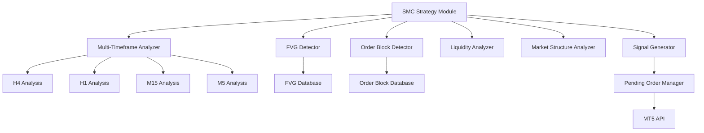

# Design Document - Smart Money Concepts (SMC) Strategy Module

## Overview

The Smart Money Concepts (SMC) Strategy Module implements institutional trading methodology based on Fair Value Gaps (FVG), Order Blocks, liquidity concepts, and multi-timeframe analysis. Unlike the momentum-based scalping strategy that uses market orders, the SMC module uses **pending orders** (Buy Limit, Sell Limit, Buy Stop, Sell Stop) to enter trades at optimal prices when price returns to key zones.

The module analyzes H4, H1, M15, and M5 timeframes to identify high-probability setups where institutional order flow is likely to drive price, then places pending orders at FVG zones and Order Blocks for precise entries.

## Architecture

### High-Level Architecture



### Technology Stack

- **Language**: Python 3.10+
- **Data Analysis**: NumPy for efficient array operations
- **Multi-timeframe**: Concurrent analysis of H4, H1, M15, M5
- **Order Types**: Pending orders (Buy/Sell Limit, Buy/Sell Stop)
- **Integration**: Plugs into existing MT5 Auto Scalper

## Components and Interfaces

### 1. FVG Detector

**Responsibility**: Identifies Fair Value Gaps across multiple timeframes.

**Interface**:
```python
class FVGDetector:
    def detect_fvgs(self, candles: List[dict], timeframe: str) -> List[FVG]
    def is_fvg_filled(self, fvg: FVG, current_price: float) -> bool
    def get_fvg_entry_price(self, fvg: FVG, direction: str) -> float
    def calculate_fvg_equilibrium(self, fvg: FVG) -> float
    def filter_valid_fvgs(self, fvgs: List[FVG]) -> List[FVG]
```

**FVG Detection Algorithm**:
```
For each 3-candle sequence:
  Bullish FVG:
    - Candle 1 low > Candle 3 high
    - Gap = [Candle 3 high, Candle 1 low]
    - Entry = Candle 3 high (Buy Limit)
    
  Bearish FVG:
    - Candle 1 high < Candle 3 low
    - Gap = [Candle 1 high, Candle 3 low]
    - Entry = Candle 3 low (Sell Limit)
```

### 2. Order Block Detector

**Responsibility**: Identifies Order Blocks and Breaker Blocks.

**Interface**:
```python
class OrderBlockDetector:
    def detect_order_blocks(self, candles: List[dict]) -> List[OrderBlock]
    def detect_breaker_blocks(self, order_blocks: List[OrderBlock], candles: List[dict]) -> List[BreakerBlock]
    def get_order_block_entry(self, ob: OrderBlock) -> float
    def is_order_block_valid(self, ob: OrderBlock, current_price: float) -> bool
```

**Order Block Detection Algorithm**:
```
Bullish Order Block:
  1. Find significant bullish move (e.g., 3+ consecutive green candles)
  2. Last red/bearish candle before move = Order Block
  3. Entry = 50% of Order Block (Buy Limit)
  4. Invalidation = Below Order Block low
  
Bearish Order Block:
  1. Find significant bearish move (e.g., 3+ consecutive red candles)
  2. Last green/bullish candle before move = Order Block
  3. Entry = 50% of Order Block (Sell Limit)
  4. Invalidation = Above Order Block high
```

### 3. Multi-Timeframe Analyzer

**Responsibility**: Coordinates analysis across H4, H1, M15, M5 timeframes.

**Interface**:
```python
class MultiTimeframeAnalyzer:
    def analyze_all_timeframes(self, symbol: str) -> TimeframeAnalysis
    def get_htf_bias(self, h4_data: dict, h1_data: dict) -> str  # "BULLISH" or "BEARISH"
    def find_confluence_zones(self, tf_analysis: TimeframeAnalysis) -> List[ConfluenceZone]
    def check_fvg_alignment(self, h4_fvg: FVG, h1_fvg: FVG) -> bool
```

**Multi-Timeframe Logic**:
```
1. H4 Analysis:
   - Determine overall trend (BOS/CHoCH)
   - Identify major FVGs and Order Blocks
   - Define Premium/Discount zones
   
2. H1 Analysis:
   - Confirm H4 bias
   - Find H1 FVGs within H4 zones
   - Identify entry Order Blocks
   
3. M15/M5 Analysis:
   - Confirm entry timing
   - Detect liquidity sweeps
   - Fine-tune entry prices
```

### 4. Liquidity Analyzer

**Responsibility**: Detects liquidity sweeps and key liquidity levels.

**Interface**:
```python
class LiquidityAnalyzer:
    def identify_liquidity_levels(self, candles: List[dict]) -> List[LiquidityLevel]
    def detect_sweep(self, candles: List[dict], level: LiquidityLevel) -> Optional[Sweep]
    def is_buyside_liquidity_swept(self, candles: List[dict]) -> bool
    def is_sellside_liquidity_swept(self, candles: List[dict]) -> bool
```

**Liquidity Detection**:
```
Buyside Liquidity:
  - Recent swing highs
  - Equal highs
  - Sweep = price breaks high by 5-10 pips then reverses
  
Sellside Liquidity:
  - Recent swing lows
  - Equal lows
  - Sweep = price breaks low by 5-10 pips then reverses
```

### 5. Market Structure Analyzer

**Responsibility**: Identifies BOS, CHoCH, and trend direction.

**Interface**:
```python
class MarketStructureAnalyzer:
    def identify_structure(self, candles: List[dict]) -> MarketStructure
    def detect_bos(self, candles: List[dict]) -> Optional[BOS]
    def detect_choch(self, candles: List[dict]) -> Optional[CHoCH]
    def get_trend_direction(self, structure: MarketStructure) -> str
```

**Market Structure Logic**:
```
Uptrend:
  - Higher Highs (HH) and Higher Lows (HL)
  - BOS = break above previous HH
  
Downtrend:
  - Lower Highs (LH) and Lower Lows (LL)
  - BOS = break below previous LL
  
CHoCH:
  - Uptrend: break below previous HL
  - Downtrend: break above previous LH
```

### 6. Pending Order Manager

**Responsibility**: Places and manages pending orders at SMC zones.

**Interface**:
```python
class PendingOrderManager:
    def place_buy_limit(self, symbol: str, price: float, sl: float, tp: float, volume: float) -> Optional[int]
    def place_sell_limit(self, symbol: str, price: float, sl: float, tp: float, volume: float) -> Optional[int]
    def place_buy_stop(self, symbol: str, price: float, sl: float, tp: float, volume: float) -> Optional[int]
    def place_sell_stop(self, symbol: str, price: float, sl: float, tp: float, volume: float) -> Optional[int]
    def cancel_pending_order(self, ticket: int) -> bool
    def get_pending_orders(self) -> List[PendingOrder]
    def manage_pending_orders(self) -> None  # Cancel expired/invalid orders
```

**Order Type Selection**:
```
Buy Limit:
  - Price is ABOVE current price
  - Expecting pullback to FVG/OB then bounce up
  - Use for: Bullish FVG, Bullish Order Block in discount
  
Sell Limit:
  - Price is BELOW current price
  - Expecting rally to FVG/OB then drop down
  - Use for: Bearish FVG, Bearish Order Block in premium
  
Buy Stop:
  - Price is ABOVE current price
  - Expecting breakout continuation
  - Use for: BOS confirmation, liquidity sweep reversal up
  
Sell Stop:
  - Price is BELOW current price
  - Expecting breakdown continuation
  - Use for: BOS confirmation, liquidity sweep reversal down
```

### 7. SMC Signal Generator

**Responsibility**: Generates high-probability SMC trade signals.

**Interface**:
```python
class SMCSignalGenerator:
    def analyze_setup(self, symbol: str) -> Optional[SMCSignal]
    def calculate_entry_price(self, setup: SMCSetup) -> float
    def calculate_stop_loss(self, setup: SMCSetup) -> float
    def calculate_take_profit(self, setup: SMCSetup) -> float
    def get_order_type(self, setup: SMCSetup, current_price: float) -> str
    def validate_signal(self, signal: SMCSignal) -> bool
```

### 8. Symbol Filter

**Responsibility**: Manages symbol whitelist and broker-specific symbol mapping.

**Interface**:
```python
class SymbolFilter:
    def __init__(self, mt5_connection):
        self.whitelisted_symbols = ["US30", "XAUUSD", "US30 FT", "NASDAQ", "NASDAQ FT"]
        self.symbol_map = {}  # Maps standard names to broker symbols
        
    def initialize_symbol_mapping(self) -> None
    def get_broker_symbol(self, standard_name: str) -> Optional[str]
    def is_symbol_whitelisted(self, symbol: str) -> bool
    def get_tradeable_symbols(self) -> List[str]
```

**Symbol Mapping Logic**:
```
Standard Symbol -> Broker Variations:
  US30 -> ["US30", "US30.cash", "US30Cash", "USTEC", "DJ30"]
  XAUUSD -> ["XAUUSD", "XAUUSD.a", "GOLD", "Gold"]
  US30 FT -> ["US30ft", "US30.f", "US30_FUT"]
  NASDAQ -> ["NAS100", "USTEC", "NDX", "NASDAQ"]
  NASDAQ FT -> ["NAS100ft", "NAS100.f", "USTEC_FUT"]
  
Algorithm:
  1. Get all available symbols from broker
  2. For each whitelisted symbol:
     - Search for exact match
     - Search for partial match (case-insensitive)
     - Search for common variations
  3. Store mapping: standard_name -> broker_symbol
  4. Log any unmapped symbols as warnings
```

### 9. Market Hours Manager

**Responsibility**: Tracks trading sessions and determines if markets are open.

**Interface**:
```python
class MarketHoursManager:
    def __init__(self):
        self.trading_sessions = {}  # symbol -> session schedule
        
    def load_trading_sessions(self) -> None
    def is_market_open(self, symbol: str, current_time: datetime) -> bool
    def get_next_open_time(self, symbol: str) -> datetime
    def get_tradeable_symbols_now(self) -> List[str]
```

**Trading Session Schedules**:
```
US30 (Dow Jones):
  - Sunday 23:00 GMT - Friday 22:00 GMT
  - Daily break: 22:00 - 23:00 GMT
  
XAUUSD (Gold):
  - Sunday 23:00 GMT - Friday 22:00 GMT
  - Daily break: 22:00 - 23:00 GMT
  
NASDAQ (NAS100):
  - Sunday 23:00 GMT - Friday 22:00 GMT
  - Daily break: 22:00 - 23:00 GMT
  
Note: Futures contracts may have slightly different hours
```

**Signal Generation Logic**:
```
High-Probability Setup Requirements:
  1. H4 trend bias established (BOS confirmed)
  2. H1 FVG exists within H4 FVG (confluence)
  3. Price in discount (for buys) or premium (for sells)
  4. Order Block present at entry zone
  5. Optional: Recent liquidity sweep
  
Entry Calculation:
  - Primary: 50% of FVG
  - Secondary: 50% of Order Block
  - Confluence: Where FVG and OB overlap
  
Stop Loss:
  - Below/above Order Block
  - Beyond FVG invalidation point
  - Typically 1-2% from entry
  
Take Profit:
  - Next opposing FVG
  - Next Order Block
  - Recent high/low
  - Typically 2-5% from entry (2:1 to 5:1 RR)
```

## Data Models

### FVG (Fair Value Gap)
```python
@dataclass
class FVG:
    timeframe: str  # "H4", "H1", "M15", "M5"
    direction: str  # "BULLISH" or "BEARISH"
    high: float
    low: float
    equilibrium: float  # 50% level
    created_at: datetime
    filled: bool
    candle_index: int
```

### OrderBlock
```python
@dataclass
class OrderBlock:
    timeframe: str
    direction: str  # "BULLISH" or "BEARISH"
    high: float
    low: float
    entry_price: float  # 50% level
    created_at: datetime
    valid: bool
    strength: float  # Based on subsequent move size
```

### BreakerBlock
```python
@dataclass
class BreakerBlock:
    original_ob: OrderBlock
    direction: str  # Opposite of original OB
    high: float
    low: float
    entry_price: float
    created_at: datetime
```

### LiquidityLevel
```python
@dataclass
class LiquidityLevel:
    price: float
    type: str  # "BUYSIDE" or "SELLSIDE"
    strength: int  # Number of touches
    swept: bool
    sweep_time: Optional[datetime]
```

### MarketStructure
```python
@dataclass
class MarketStructure:
    trend: str  # "UPTREND", "DOWNTREND", "RANGING"
    swing_highs: List[float]
    swing_lows: List[float]
    last_bos: Optional[datetime]
    last_choch: Optional[datetime]
```

### ConfluenceZone
```python
@dataclass
class ConfluenceZone:
    high: float
    low: float
    entry_price: float
    components: List[str]  # ["H4_FVG", "H1_FVG", "ORDER_BLOCK"]
    confidence: float  # 0.0 to 1.0
    direction: str  # "BULLISH" or "BEARISH"
```

### SMCSignal
```python
@dataclass
class SMCSignal:
    symbol: str
    direction: str  # "BUY" or "SELL"
    order_type: str  # "BUY_LIMIT", "SELL_LIMIT", "BUY_STOP", "SELL_STOP"
    entry_price: float
    stop_loss: float
    take_profit: float
    confidence: float
    setup_type: str  # "FVG_ENTRY", "OB_ENTRY", "CONFLUENCE", "LIQUIDITY_SWEEP"
    timeframe_bias: dict  # {"H4": "BULLISH", "H1": "BULLISH"}
    zones: List[ConfluenceZone]
    timestamp: datetime
```

### PendingOrder
```python
@dataclass
class PendingOrder:
    ticket: int
    symbol: str
    order_type: str
    entry_price: float
    stop_loss: float
    take_profit: float
    volume: float
    placed_at: datetime
    expires_at: datetime
    smc_setup: str
```

### SymbolMapping
```python
@dataclass
class SymbolMapping:
    standard_name: str  # "US30", "XAUUSD", etc.
    broker_symbol: str  # Actual broker symbol
    is_available: bool
    point_value: float  # For pip calculation
    min_lot: float
    max_lot: float
```

### TradingSession
```python
@dataclass
class TradingSession:
    symbol: str
    open_time: time  # Daily open time (GMT)
    close_time: time  # Daily close time (GMT)
    break_start: Optional[time]  # Daily break start
    break_end: Optional[time]  # Daily break end
    trading_days: List[int]  # 0=Monday, 6=Sunday
```

## Correctness Properties

*A property is a characteristic or behavior that should hold true across all valid executions of a system—essentially, a formal statement about what the system should do. Properties serve as the bridge between human-readable specifications and machine-verifiable correctness guarantees.*

### Property 1: Multi-timeframe FVG Detection
*For any* symbol with price data, when the FVG detector analyzes the data, it should return FVG lists for all four timeframes (H4, H1, M15, M5).
**Validates: Requirements 1.1**

### Property 2: FVG Level Calculation
*For any* detected FVG, the equilibrium level should equal (high + low) / 2, and all three levels (high, low, equilibrium) should be populated.
**Validates: Requirements 1.2, 3.1**

### Property 3: FVG Fill Status Tracking
*For any* set of FVGs, when price moves through their zones, the filled status should be correctly updated to reflect which FVGs have been filled and which remain unfilled.
**Validates: Requirements 1.3**

### Property 4: Timeframe Confluence Detection
*For any* pair of FVGs from different timeframes that overlap in price range, the system should flag them as high-priority/high-confidence zones.
**Validates: Requirements 1.4, 6.3**

### Property 5: FVG Zone Entry Notification
*For any* active FVG, when current price enters the FVG's price range (between high and low), a notification should be generated.
**Validates: Requirements 1.5**

### Property 6: Order Block Identification
*For any* price sequence with a significant move (>20 pips), the last opposite-direction candle before the move should be identified as an Order Block.
**Validates: Requirements 2.1**

### Property 7: Order Block Level Calculation
*For any* detected Order Block, it should have high, low, and entry_price (50% level) calculated, where entry_price = (high + low) / 2.
**Validates: Requirements 2.2**

### Property 8: Order Block to Breaker Block Conversion
*For any* Order Block, when price breaks through it (closes beyond the opposite extreme), it should be converted to a Breaker Block with opposite direction.
**Validates: Requirements 2.3**

### Property 9: Breaker Block Tracking
*For any* Breaker Block created, it should appear in the system's tracked reversal zones list.
**Validates: Requirements 2.4**

### Property 10: Block Retest Signal Generation
*For any* Order Block or Breaker Block, when price returns to its zone, an entry signal should be generated.
**Validates: Requirements 2.5**

### Property 11: Premium and Discount Zone Classification
*For any* price range with calculated equilibrium, prices above the 50% level should be classified as Premium zone (SELL bias) and prices below should be classified as Discount zone (BUY bias).
**Validates: Requirements 3.2, 3.3, 3.4**

### Property 12: Bias Update on Equilibrium Cross
*For any* tracked price range, when price crosses the 50% equilibrium level, the system bias should update accordingly (from BUY to SELL or vice versa).
**Validates: Requirements 3.5**

### Property 13: Liquidity Sweep Detection
*For any* recent swing high or low, when price breaks beyond it by a small amount (5-10 pips) and then reverses, the system should detect this as a liquidity sweep (buyside for highs, sellside for lows).
**Validates: Requirements 4.1, 4.2, 4.3**

### Property 14: Liquidity Sweep Signal Generation
*For any* detected liquidity sweep followed by price reversal, the system should generate a high-confidence entry signal in the reversal direction.
**Validates: Requirements 4.4**

### Property 15: Liquidity Sweep Sequence Tracking
*For any* series of liquidity sweeps, the system should maintain a chronological record of all sweeps for pattern recognition.
**Validates: Requirements 4.5**

### Property 16: Market Structure Identification
*For any* price sequence, the system should correctly identify the trend structure: Higher Highs and Higher Lows for uptrends, Lower Highs and Lower Lows for downtrends.
**Validates: Requirements 5.1, 5.2**

### Property 17: Break of Structure Detection
*For any* established market structure, when price breaks the previous structural high (in uptrend) or low (in downtrend), a BOS should be detected.
**Validates: Requirements 5.3**

### Property 18: Change of Character Detection
*For any* established trend, when market structure shifts direction (breaks previous HL in uptrend or LH in downtrend), a CHoCH should be detected.
**Validates: Requirements 5.4**

### Property 19: Trend Bias Update After CHoCH
*For any* detected CHoCH event, the system should update the trend bias and begin looking for reversal setups in the new direction.
**Validates: Requirements 5.5**

### Property 20: H4 Trend Verification
*For any* potential trade analysis, the system should check and include the H4 timeframe trend direction in the analysis.
**Validates: Requirements 6.1**

### Property 21: Multi-Timeframe Alignment Verification
*For any* trade setup, when H4 trend is established, the system should verify that H1 structure aligns with the H4 direction.
**Validates: Requirements 6.2**

### Property 22: Aligned Timeframe High-Confidence Signals
*For any* trade setup where all analyzed timeframes (H4, H1, M15, M5) align in direction, the system should generate a high-confidence signal.
**Validates: Requirements 6.4**

### Property 23: Conflicting Timeframe Handling
*For any* trade setup where timeframes conflict in direction, the system should either skip the trade or reduce the position size.
**Validates: Requirements 6.5**

### Property 24: Volume Imbalance Detection
*For any* price data analyzed, unfilled volume imbalances should be identified and tracked.
**Validates: Requirements 7.1**

### Property 25: Volume Imbalance Data Completeness
*For any* detected Volume Imbalance, it should have location (price level) and size (gap magnitude) fields populated.
**Validates: Requirements 7.2**

### Property 26: Volume Imbalance Fill Anticipation
*For any* Volume Imbalance, when price approaches its zone, the system should anticipate a potential fill.
**Validates: Requirements 7.3**

### Property 27: Volume Imbalance Removal After Fill
*For any* Volume Imbalance, when price fills the gap, it should be removed from active tracking.
**Validates: Requirements 7.4**

### Property 28: Volume Imbalance Prioritization
*For any* set of multiple unfilled Volume Imbalances, the system should prioritize the nearest ones (closest to current price) for analysis.
**Validates: Requirements 7.5**

### Property 29: Signal Generation on Condition Alignment
*For any* symbol, when all SMC conditions align (trend, FVG, Order Block, confluence), an entry signal should be generated.
**Validates: Requirements 8.1**

### Property 30: Signal Data Completeness
*For any* generated SMC signal, it should include entry_price, stop_loss, and take_profit levels.
**Validates: Requirements 8.2**

### Property 31: Stop Loss Placement Beyond Invalidation
*For any* signal with an Order Block, the stop loss should be placed beyond the invalidation point (below the Order Block low for buys, above the Order Block high for sells).
**Validates: Requirements 8.3**

### Property 32: Take Profit Target Selection
*For any* generated signal, the take profit should target one of: the next opposing FVG, the next Order Block, or a liquidity level.
**Validates: Requirements 8.4**

### Property 33: Low Confidence Signal Handling
*For any* potential signal with low confidence score, the system should either skip the trade or suggest a reduced position size.
**Validates: Requirements 8.5**

### Property 34: Hybrid Mode Strategy Combination
*For any* system running in Hybrid mode, it should use SMC analysis for directional bias and Momentum strategy for entry timing.
**Validates: Requirements 9.2**

### Property 35: Hybrid Mode Bearish Bias Filtering
*For any* Momentum signal in Hybrid mode, when SMC bias is bearish, only SELL signals should be taken.
**Validates: Requirements 9.3**

### Property 36: Hybrid Mode Bullish Bias Filtering
*For any* Momentum signal in Hybrid mode, when SMC bias is bullish, only BUY signals should be taken.
**Validates: Requirements 9.4**

### Property 37: Signal Conflict Prioritization
*For any* situation where SMC and Momentum signals conflict in direction, the system should prioritize the SMC signal.
**Validates: Requirements 9.5**

### Property 38: SMC Event Logging
*For any* SMC analysis run, all detected FVGs, Order Blocks, signals, and trade executions should be logged with their relevant details (levels, zones, setup types).
**Validates: Requirements 10.1, 10.2, 10.3, 10.5**

### Property 39: Status Display Completeness
*For any* status display request, the output should include the current bias (bullish/bearish) and all active zones (FVGs, Order Blocks).
**Validates: Requirements 10.4**

### Property 40: Symbol Whitelist Enforcement
*For any* symbol analyzed by the SMC module, it should only proceed with analysis if the symbol is in the whitelist (US30, XAUUSD, US30 FT, NASDAQ, NASDAQ FT).
**Validates: Requirements 11.1, 11.4**

### Property 41: Symbol Mapping Completeness
*For any* whitelisted symbol that exists on the broker, the system should successfully map the standard name to the broker-specific symbol name.
**Validates: Requirements 11.2, 11.3**

### Property 42: Market Hours Filtering
*For any* symbol at any given time, the system should correctly determine if the market is open based on the trading session schedule.
**Validates: Requirements 12.1, 12.2, 12.3**

### Property 43: Closed Market Signal Suppression
*For any* symbol whose market is closed, the system should not generate signals or place orders for that symbol.
**Validates: Requirements 12.3**

### Property 44: Market Status Display
*For any* status display request, the output should indicate which symbols are currently tradeable based on market hours.
**Validates: Requirements 12.5**

## Integration with Existing System

### Strategy Selection

```python
class StrategySelector:
    MOMENTUM = "momentum"  # Existing aggressive scalping
    SMC = "smc"  # New SMC pending orders
    HYBRID = "hybrid"  # SMC bias + Momentum entries
```

**Hybrid Mode Logic**:
```
1. SMC Module determines bias (BULLISH/BEARISH)
2. SMC identifies key zones (FVGs, Order Blocks)
3. Momentum strategy only takes signals aligned with SMC bias
4. If price in SMC zone + Momentum signal = high confidence entry
```

## Implementation Notes

### FVG Detection Performance

- Cache detected FVGs to avoid recalculation
- Update FVG status (filled/unfilled) on each price update
- Remove filled FVGs after 24 hours

### Order Management

- Maximum 3 pending orders per symbol
- Cancel pending orders after 4 hours if not filled
- Cancel pending orders if market structure invalidates setup
- Monitor filled pending orders same as market orders

### Multi-Timeframe Efficiency

- Fetch H4/H1 data once per hour
- Fetch M15 data every 15 minutes
- Fetch M5 data every 5 minutes
- Use cached data for analysis between updates

### Risk Management

- SMC trades typically have better RR (2:1 to 5:1)
- Can use slightly larger position sizes than momentum trades
- Maximum 2-3 SMC setups active simultaneously
- Pending orders don't count against max positions until filled

## Testing Strategy

### Unit Tests
Unit tests verify specific examples, edge cases, and error conditions:
- FVG detection with known 3-candle patterns
- Order Block identification with specific price sequences
- Market structure analysis with predefined swing points
- Pending order placement with edge cases (invalid prices, broker rejections)
- Premium/Discount zone classification at boundary conditions

### Property-Based Tests
Property-based tests verify universal properties across all inputs using **Hypothesis** (Python's property-based testing library). Each property test should run a minimum of 100 iterations.

Each property-based test MUST be tagged with a comment explicitly referencing the correctness property from this design document using this format:
```python
# Feature: smc-strategy, Property X: [property text]
```

Key property tests to implement:
- **Property 2**: FVG equilibrium calculation for randomly generated FVGs
- **Property 7**: Order Block 50% level calculation for random blocks
- **Property 11**: Premium/Discount classification for random price ranges
- **Property 13**: Liquidity sweep detection with random swing points
- **Property 16**: Market structure identification with random price sequences
- **Property 30**: Signal completeness for all generated signals
- **Property 38**: Logging completeness for all SMC events

### Integration Tests
- Multi-timeframe data synchronization across H4, H1, M15, M5
- Signal generation with real market data
- Pending order lifecycle management (placement, expiry, cancellation)
- Hybrid mode coordination between SMC and Momentum strategies

### Backtesting
- Historical FVG performance and fill rates
- Order Block hit rate and reliability
- Confluence zone win rate
- Compare SMC vs Momentum performance metrics

## Configuration

```python
SMC_CONFIG = {
    "timeframes": ["H4", "H1", "M15", "M5"],
    "fvg_min_size_pips": 5,
    "order_block_min_move": 20,  # pips
    "pending_order_expiry_hours": 4,
    "max_pending_orders_per_symbol": 3,
    "confluence_min_components": 2,
    "liquidity_sweep_threshold_pips": 10,
    "risk_reward_min": 2.0,
    
    # Symbol filtering
    "whitelisted_symbols": ["US30", "XAUUSD", "US30 FT", "NASDAQ", "NASDAQ FT"],
    "symbol_variations": {
        "US30": ["US30", "US30.cash", "US30Cash", "USTEC", "DJ30", "DJI"],
        "XAUUSD": ["XAUUSD", "XAUUSD.a", "GOLD", "Gold", "XAU"],
        "US30 FT": ["US30ft", "US30.f", "US30_FUT", "YM"],
        "NASDAQ": ["NAS100", "USTEC", "NDX", "NASDAQ", "US100"],
        "NASDAQ FT": ["NAS100ft", "NAS100.f", "USTEC_FUT", "NQ"],
    },
    
    # Market hours (GMT)
    "trading_sessions": {
        "US30": {"open": "23:00", "close": "22:00", "break_start": "22:00", "break_end": "23:00"},
        "XAUUSD": {"open": "23:00", "close": "22:00", "break_start": "22:00", "break_end": "23:00"},
        "NASDAQ": {"open": "23:00", "close": "22:00", "break_start": "22:00", "break_end": "23:00"},
    },
}
```

## Future Enhancements

1. **Session Analysis**: Identify Asian, London, NY session liquidity
2. **News Integration**: Avoid trades during high-impact news
3. **Correlation Analysis**: Trade correlated pairs together
4. **Machine Learning**: Learn which FVG types have highest fill rate
5. **Visual Dashboard**: Web interface showing all SMC zones on charts
